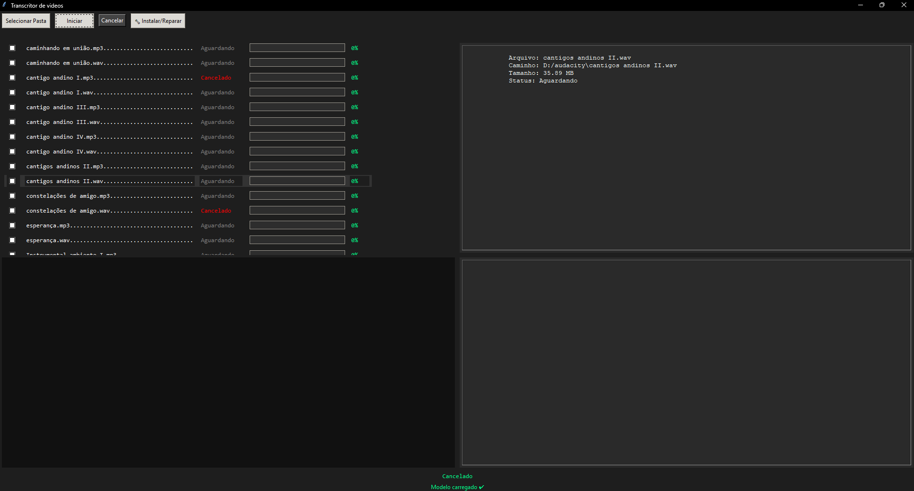

# 🎬 TranscritorPro — Sistema de Transcrição de Vídeos

> 
>
> 

---

## 📌 Sobre o Projeto

O **TranscritorPro** é uma aplicação desktop desenvolvida em Python com interface gráfica (Tkinter) para transcrição de vídeos e áudios.

O sistema utiliza processamento local com extração de áudio via FFmpeg e transcrição com modelo embarcado, sem depender de APIs externas.

---

## 🚀 Funcionalidades

✔ Seleção de pasta com vídeos/áudios
✔ Processamento por partes (mais estabilidade)
✔ Exibição de progresso em tempo real
✔ Interface em modo escuro
✔ Cancelamento de processamento
✔ Geração de arquivos `.txt` e `.pdf`

---

## ⚙️ Tecnologias Utilizadas

* Python **3.11**
* Tkinter
* FFmpeg (extração de áudio)
* Torch (execução local)
* Faster-Whisper (processamento local)
* ReportLab (PDF)

---

## ⚠️ Versão do Python (IMPORTANTE)

Este projeto é compatível com:

```bash
Python 3.11
```

❌ Não recomendado:

* Python 3.12+
* Python 3.13+
* Python 3.14 (incompatível com Torch / PyInstaller)

---

## 📦 Instalação (SEM VENV)

### 1. Instalar Python 3.11

Baixe:
👉 https://www.python.org/downloads/release/python-3110/

✔ Marque **Add Python to PATH**

---

## 🎧 2. Instalar FFmpeg (OBRIGATÓRIO)

### Passo a passo (Windows)

1. Baixe o FFmpeg:

👉 https://www.gyan.dev/ffmpeg/builds/

Versão:

✔ **release full build**

---

2. Extraia o arquivo `.zip`

```bash
C:\ffmpeg
```

Estrutura:

```bash
C:\ffmpeg\bin\ffmpeg.exe
```

---

3. Adicionar ao PATH

Adicionar:

```bash
C:\ffmpeg\bin
```

---

4. Testar instalação

```bash
ffmpeg -version
```

✔ Se aparecer informações → OK

---

## 📦 3. Instalar dependências Python

```bash
py -3.11 -m pip install torch faster-whisper reportlab ffmpeg-python
```

---

## ▶️ Como Executar

```bash
py -3.11 nome_do_arquivo.py
```

---

## 🎯 Precisão da Transcrição (CRÍTICO)

Para obter transcrição fiel ao áudio:

```python
MODEL_SIZE = "large-v3"
```

---

### 🧠 Por que usar o modelo máximo?

✔ Maior precisão de fala
✔ Melhor interpretação de contexto
✔ Menos erros em palavras
✔ Melhor pontuação automática
✔ Melhor desempenho em áudios complexos

---

### ⚠️ Modelos menores geram inconsistência

Modelos como:

```bash
medium / small / base / tiny
```

podem causar:

❌ Troca de palavras
❌ Frases sem sentido
❌ Perda de contexto
❌ Erros em nomes próprios

👉 **Quanto menor o modelo, maior a perda de qualidade**

---

### 📌 Recomendação

* Produção / uso sério → **large-v3 obrigatório**
* Testes → medium ou small

---

## ⚡ Processamento (IMPORTANTE)

O sistema utiliza **processamento pesado local**.

---

### 🔹 CPU

✔ Funciona em qualquer máquina
✔ Mais estável

---

### 🔹 GPU NVIDIA (CUDA)

✔ Acelera MUITO o processamento
✔ Detectado automaticamente

---

### ⚠️ AMD

❌ Não suporta CUDA
✔ Funciona via CPU

---

### 🔧 Forçar CPU (recomendado)

```python
DEVICE = "cpu"
COMPUTE_TYPE = "int8"
```

---

## 💻 Requisitos de Hardware

### 🔻 Mínimo (funciona)

* CPU: 4 núcleos
* RAM: 8 GB
* SSD recomendado

⚠️ Pode ser lento

---

### ⚖️ Recomendado

* CPU: 6 a 8 núcleos
* RAM: 16 GB
* SSD obrigatório

✔ Estável
✔ Sem gargalo

---

### 🚀 Ideal (alto desempenho)

* CPU: 8+ núcleos
* RAM: 32 GB
* SSD NVMe
* GPU NVIDIA (RTX 3060+)

✔ Processamento rápido
✔ Uso total do `large-v3`

---

## 📊 Performance

Depende de:

* CPU (principal fator)
* RAM
* Modelo usado
* Duração do vídeo

---

## 📁 Saída dos Arquivos

```bash
/video_nome/
 ├── video_nome.txt
 └── video_nome_relatorio.pdf
```

---

## 🧪 Fluxo de Uso

1. Selecionar pasta
2. Marcar arquivos
3. Iniciar
4. Acompanhar progresso
5. Resultado salvo automaticamente

---

## ❌ Cancelamento

✔ Interrompe execução
✔ Limpa interface
✔ Reseta estado

---

## 🧼 Comportamento

✔ Limpa transcrição ao trocar vídeo
✔ Evita reprocessamento
✔ Processamento em partes

---

## 🛠️ Problemas Comuns

### ❌ FFmpeg não funciona

✔ Verifique:

```bash
C:\ffmpeg\bin
```

---

### ❌ Aplicação fecha (.exe)

✔ Use Python 3.11
✔ Evite `--onefile` com torch
✔ Use modelo menor para teste

---

### ❌ Lento

✔ Normal com `large-v3`
✔ Depende do hardware

---

## 👨‍💻 Observação Final

O sistema prioriza:

👉 **PRECISÃO acima de velocidade**

Processamento mais lento é esperado ao usar modelos maiores.

---

## 📄 Licença

Uso livre para estudos e projetos pessoais.

---
